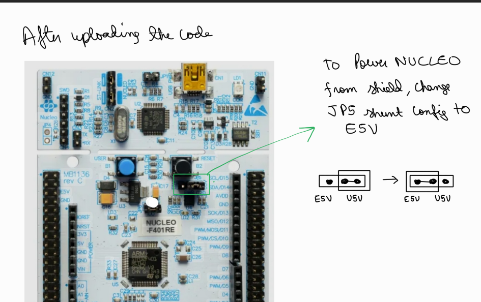

# 🚀 AlbertaLoop Firmware

This directory contains embedded firmware for all subsystem nodes of the AlbertaLoop Hyperloop pod, running on STM32 Nucleo boards. Each subsystem communicates over CAN bus using a defined message structure. Below are details of each node, CAN message mappings, test videos, and setup instructions.

---

## 📹 Test Videos

| Description | Video |
|-------------|-------|
| CAN Communication between 2 Nucleo Nodes | <video src="readme_assets/CAN_2_node_nucleo_test.mp4" controls width="400"/> |
| CAN Test from Raspberry Pi to Nucleo | <video src="readme_assets/CAN_test_pi_to_nucleo.mp4" controls width="400"/> |
| FSM Test for LED Controller (All States) | <video src="readme_assets/led_controller_fsm_test_allstates.mp4" controls width="400"/> |
| DAC Output Test on Nucleo | <video src="readme_assets/nucleo_dac_test.mp4" controls width="400"/> |
| Pi Listening to CAN Messages | <video src="readme_assets/pi_listen_can_msg.mp4" controls width="400"/> |

---

## 📡 CAN Message Protocol

### 🔧 Brakes Node  
**Message ID Range:** `0x200 – 0x2FF`

- **0x299** – Heartbeat  
  - Byte 0–1: Brake pressure (`int16`)  
  - Byte 2: Brake flag (`0 = apply`, `1 = release`)  
  - Byte 3–7: Reserved  
- **0x201** – Engage Brakes  
  - Action: Set brake GPIOs to `LOW`
- **0x202** – Disengage Brakes  
  - Action: Set brake GPIOs to `HIGH`

---

### ⚙️ Motor Driver Node  
**Message ID Range:** `0x300 – 0x3FF`

- **0x399** – Heartbeat  
  - Byte 0: `crawl_mode (0 or 1)`  
  - Byte 1: `motor_speed (0–100 = forward, 255 = reverse)`

| Message ID | Action           | GPIO | Speed (%) |
|------------|------------------|------|-----------|
| 0x301      | Stop             | SET  | 0         |
| 0x302      | Speed 10%        | SET  | 10        |
| 0x303      | Speed 30%        | SET  | 30        |
| 0x304      | Speed 50%        | SET  | 50        |
| 0x305      | Speed 70%        | SET  | 70        |
| 0x306      | Speed 100%       | SET  | 100       |
| 0x3FF      | Reverse ON       | RESET| -1        |
| 0x310      | Enable Crawl     | —    | 20        |

---

### 💡 LED Controller Node  
**Message ID Range:** `0x400 – 0x4FF`

- **0x499** – Heartbeat  
  - Byte 0–1: FSM state ID

| Message ID | FSM State        | Description |
|------------|------------------|-------------|
| `0x401`    | FAULT            | Central to system safety, triggered by critical failures like CAN/LORA comms loss, BMS issues, sensor anomalies, or brake malfunctions. Pod initiates a controlled stop. |
| `0x402`    | SAFE TO APPROACH | Passive state; pod is stationary and safe for personnel access. All systems nominal and brakes engaged. |
| `0x403`    | READY TO LAUNCH / IDLE | Activated via GUI when all systems are verified and no faults are present. Pod awaits further commands. |
| `0x404`    | OMITTED FOR KDAYS LAUNCHING | High-speed state where pod attains max velocity (used during K-Days demo). |
| `0x405`    | CRAWLING         | Low-speed propulsion state for controlled movement/testing. Entered via GUI after Ready to Launch. |
| `0x406`    | BRAKING          | Triggered automatically or manually near end of track or during hazards. Supports normal and emergency braking. |
| `0x407`    | TESTING / DEBUG  | Diagnostic mode to validate subsystem functionality via GUI/scripted checks. |

> These FSM states are used by the LED Controller to reflect the current operational mode of the pod visually and programmatically.

---

## 🛠️ Flashing Firmware on STM32 Nucleo Boards

### 1. Install STM32CubeIDE  
Download and install from:  
🔗 https://www.st.com/en/development-tools/stm32cubeide.html

### 2. Clone the Repo  
```bash
git clone https://github.com/albertaloop/T_SWE_2025_2026
```
## 🛠️ Flashing Firmware to STM32 Nucleo Boards

### 3. 📁 Import Projects into STM32CubeIDE

- Open **STM32CubeIDE**
- Go to **File > Open Projects from File System**
- Navigate to the `firmware/` directory
- Select all project folders (ignore the `void/` folder)
- Click **Finish** to import

---

### 4. 🔌 Flash Code to Nucleo Boards

> ⚠️ **Important:** Plug in **one Nucleo board at a time** to avoid USB port conflicts.

For each subsystem:

- Right-click on the project in the **Project Explorer**
- Select **Run As > STM32 Cortex-M C/C++ Application**
- Wait for a successful upload confirmation

---

### 5. 🔁 Final Step: Change JP5 Shunt

After flashing the firmware, **move the JP5 jumper** on the Nucleo board to disconnect ST-Link power.  
This enables isolated power delivery to the board from your main power source (e.g., the pod's power bus).
