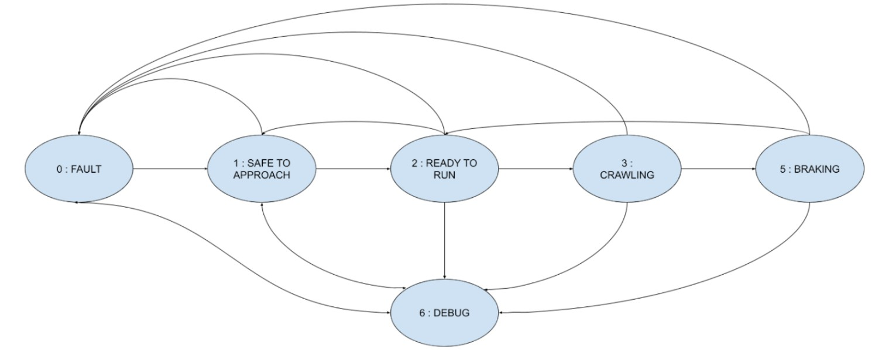

# T_SWE_2025_2026

This repository references three modules Controller, Firmware, and FSM. These modules contain all of the software for Albertaloop during the 2025-2026 school year. 

Modules:
1. Controller/ contains the GUI that runs on the controller raspberry pi (client) connected to SX1276 LORA and allows user to send the relevant commands to the rover.

2. FSM/ contains the main code that runs on the Main Processing Unit/ Raspberry pi (server) on the pod. It receives the messages sent by the controller/LORA and sends them over to the CANbus.

3. Firmwares/ contains the codes to the nucleo boards subsystems: LED controller, Motor controller, and Braking module.  

Branches info:
Branch CANdrivers contains the following drivers:
- Loopback
- Loopback IT
- Normal 2 node mode
With normal 2 node mode, the bus can be tested - sends data both ways and requests RTR

